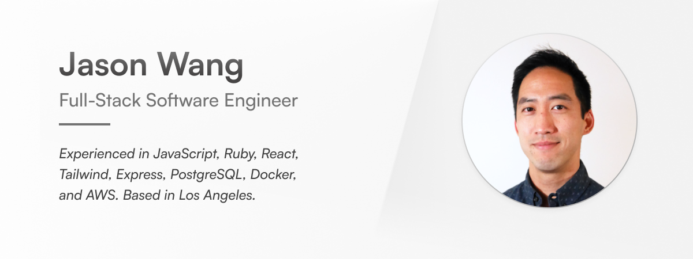

## Welcome to my GitHub!

I’m a software engineer who enjoys diving into complex domains and solving unstructured problems. My experience is mostly in JavaScript, Ruby, React, Tailwind, Express, PostgreSQL, Docker, and AWS, but I’m enthusiastic about learning whatever is needed to achieve a robust solution. I bring over a decade of experience in tackling engineering challenges, improving processes through automation, and leading cross-functional efforts.

Over the past year and a half, I’ve taken an incredible journey through Launch School’s Core and [Capstone](https://launchschool.com/employers) programs, gaining a solid foundation of software engineering fundamentals and the skills to analyze and articulate problems from a systems perspective.

Recently I collaborated with a remote team to create [Seamless](https://seamless-cicd.com/), an open-source CI/CD pipeline for containerized microservices. Currently I’m looking to join a great software engineering team and would love to chat about any opportunities. If you see anything interesting on my profile or website, feel free to reach out!

- [Website](https://www.jasonherngwang.com/)
- Email: [jasonherngwang@gmail.com](mailto:jasonherngwang@gmail.com)
- [Link to Resume](https://jasonherngwang.com/Jason_Wang_Resume.pdf)
- [Seamless CI/CD Case Study](https://seamless-cicd.com/)