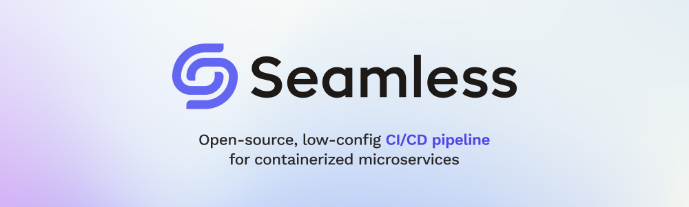

# Welcome!

I’m Jason, a software engineer who enjoys diving into complex domains and solving unstructured problems. My experience is mostly in JavaScript, Ruby, React, Tailwind, Express, PostgreSQL, Docker, and AWS, but I’m enthusiastic about learning any technologies or skills that will help the team succeed.

## Featured Project

Over the past year I’ve been learning software engineering at Launch School, gaining a solid foundation of fundamentals and the ability to analyze and articulate problems from a systems perspective. Most recently, I collaborated with a remote team to create [Seamless](https://seamless-cicd.com/), an open-source CI/CD pipeline for containerized microservices.

Check out the [Case Study](https://seamless-cicd.com/case-study) and [Tech Talk](https://www.youtube.com/watch?v=L-WuIpvBv38) for more details!

**Currently I’m looking for a software engineering position and would love to learn about you and what you’re doing. Don’t hesitate to reach out If you see anything interesting on my profile or website!**

- [Website](https://www.jasonherngwang.com/)
- [Resume](https://jasonherngwang.com/Jason_Wang_Resume.pdf)
- [LinkedIn](https://www.linkedin.com/in/jasonherngwang/)
- Email: [jasonherngwang@gmail.com](mailto:jasonherngwang@gmail.com)
